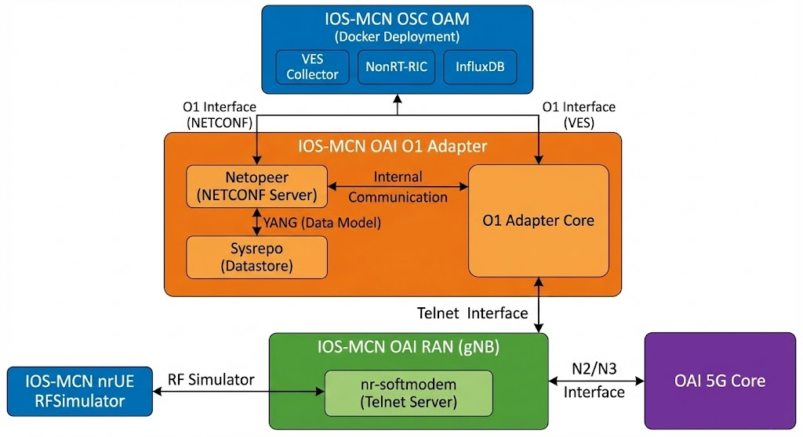

# IOS-MCN OAI Deployment Repository

This repository contains deployment guides and configuration files for setting up OpenAirInterface (OAI) CN5G integrated with IOS-MCN RAN and management and orchestration stack.

## Quick Navigation

1. Start with [oai-cn5g.md](oai-cn5g.md) to deploy the OAI 5G Core Network using Docker containers.
2. Follow [iosmcn-oai-ran.md](iosmcn-oai-ran.md) to deploy gNB and NR UE in RF simulator mode.
3. Use [iosmcn-oai-o1-adapter.md](iosmcn-oai-o1-adapter.md) to deploy the IOS-MCN O1 Adapter.
4. Deploy [iosmcn-osc-oam.md](iosmcn-osc-oam.md) IOS-MCN OAM stack.

For detailed system requirements, refer to individual deployment guides.
